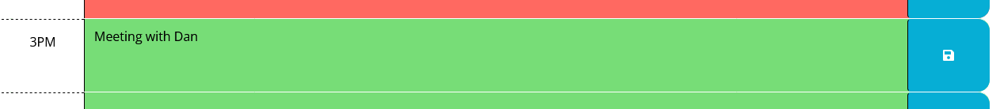
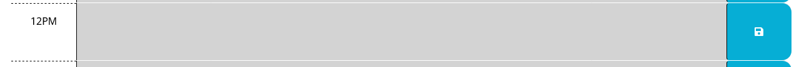
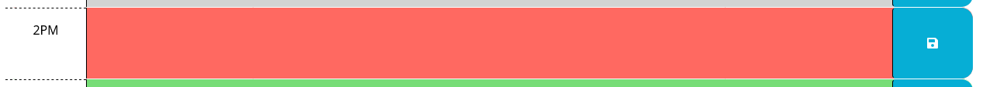
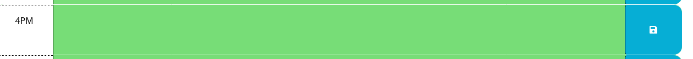
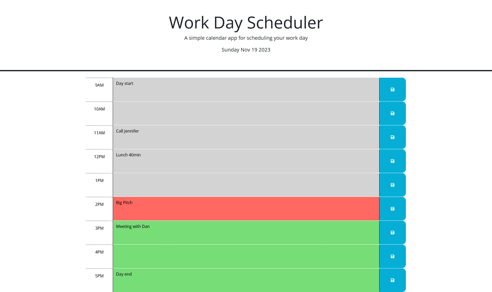

# Scheduler
## Description
This application is a scheduler for employees. They can type their daily tasks into the type space and save it with a save button and it will stay when the page is refreshed. The colors of the background indicate the time of day by changing according to the time. With this scheduler they can keep track of their tasks throughout the day.
## Webpage
[Scheduler]()
## Usage
First type the task into the time’s text-box.\
\
Then click the same time’s save button.\
\
It will remain until you save a new version.\
Throughout the day the colors of the background will change.\
Grey for past,\
\
Red for present\

And Green for future

## Screenshots
Empty

Some Tasks

